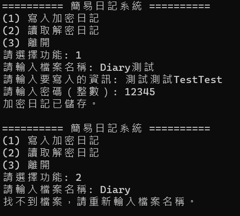
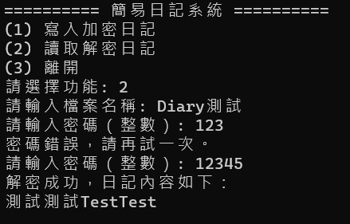
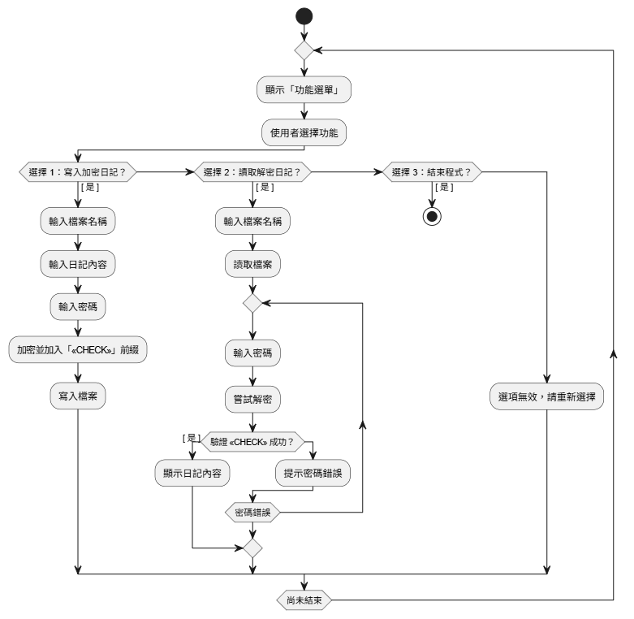

<h1 style="font-size: 28px;">SimpleDiary - C++ 加密日記系統</h1>

本專案為課堂 C++ 作業，實作一個簡易的加密日記系統。

使用者可透過密碼加密文字並儲存至檔案，再透過相同密碼成功解密。

<h2 style="font-size: 20px;">系統畫面展示</h2>

  
  

<h2>功能介紹</h2>
<ul>
  <li>寫入加密日記：使用者輸入日記文字與密碼，系統將進行簡易偏移加密後儲存至指定檔案。</li>
  <li>解密讀取日記：讀取檔案並要求使用者輸入密碼，輸入正確方能顯示內容，並利用 "CHECK" 前綴作為驗證機制。</li>
  <li>讀取日記名稱或密碼錯誤時將提示重新輸入，直到正確為止。</li>
</ul>

<h2>系統流程圖</h2>

